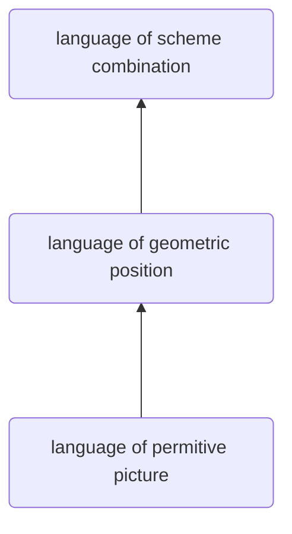

使用向量：

```scheme
(define (+vect v1 v2)
  (make-vector
      (+ (xcor v1) (xcor v2))
      (+ (ycor v1) (ycor v2))))

;; use vectors
(define (scale s v)
  (make-vector (* s (xcor v))
               (* s (ycor v))))
```

表示向量，我么可以用cons/car/cdr来表示：

```scheme
;; repressenting vector
(define make-vector cons)
(define xcor car) 
(define ycor cdr)
```

但是如果我们想表示一个从（2， 3） 到（ 5， 1） 的向量，可以这样表示：

```scheme
(make-seg (make-vector 2 3)
          (make-vector 5 1))
```

这样构造的 pair 指向两个不同的 pair 组合而成。

the set of data object in lisp is closed under the operation of forming pairs.

```scheme
(cons 1
      (cons 2
            (cons 3
                  (cons 4 nil))))
```

	
这种写法实在是不行，所以，scheme中有一个 `list` 关键字实现：

```scheme
(define one-through-four (list 1 2 3 4))

one-through-four ;; 1 2 3 4
(car one-through-four) ;; 1
(cdr one-through-four) ;; 2 3 4
(car (cdr one-through-four)) ;; 2
(cons 10 one-through-four) ;; 10 1 2 3 4
```

我们可以：

```scheme
(define (scale-list items factor)
  (if (null? items)
      nil
      (cons (* (car items) factor) ;; first element of scale list
            (scale-list (cdr items) factor)))) ;;the rest element of scale list

(scale-list (list 1 2 3 4 5 6 7 8 9) 10)
```

或者：

```scheme
(define (scale-lt s l)
  (if (null? l)
      nil
      (cons (* (car l) s)
            (scale-lt s (cdr l)))))

(scale-lt 10 (list 1 2 3 4))
```

注意后者是两个参数的位置和前者相反。

可能有一种通用的函数，我们不必写成这样，可以更抽象的提取出来，做成一个更高阶的函数来处理列表中的每一个元素：map。map要做的就是对于列表 items 中的每个元素，都执行 proc 方法。

所以，map版本的 scale-list 可以写成这样：

```scheme
(define (scale-list items factor)
  (map (lambda (x) (* x factor))
       items))

(scale-list (list 1 2 3 4 5) 10)
```

或者，我们还可以替换一下 scale-list：

```scheme
(define (map proc items)
  (if (null? items)
      nil
      (cons (proc (car items))
            (map proc (cdr items)))))

(map abs (list -10 2.5 -11.6 17))
```

这样就可以扩展了功能：对于一个列表，和一些想要做的行为作为函数，然后使用该函数，依次对列表中的元素进行操作。不要尝试创建一个新的列表，只是对原有列表的元素执行操作.

```scheme
(define (for-each proc items)
  (cond ((null? items) "done")
        (else (proc (car items))
              (for-each proc (cdr items)))))


(for-each (lambda (x) (newline) (display x))
          (list 57 321 88))
```

这里的 for-each 就和 map 基本一致，除了返回值不一样。如果想要逐个显示列表中的元素，使用 for-each 更好。

map 创建了一个新的列表，但是这里的 for-each 就不是。

--------------

实现全排列：

```scheme
#lang sicp

(define (accumulate op initial sequence)
  (if (null? sequence)
      initial
      (op (car sequence)
          (accumulate op initial (cdr sequence)))))

(define (enumerate-interval low high)
  (if (> low high)
      nil
      (cons low (enumerate-interval (+ low 1) high))))


(define (flatmap proc seq)
  (accumulate append nil (map proc seq)))

(define (filter predicate sequence)
  (cond ((null? sequence) nil)
        ((predicate (car sequence))
         (cons (car sequence)
               (filter predicate (cdr sequence))))
        (else (filter predicate (cdr sequence)))))

(define (remove item sequence)
  (filter (lambda (x) (not (= x item)))
          sequence))

(define (permutations s)
  (if (null? s)                         ; empty set?
      (list nil)                        ; sequence containing empty set
      (flatmap (lambda (x)
                 (map (lambda (p) (cons x p))
                      (permutations (remove x s))))
               s)))

(permutations '(1 2 3))
```


-----
## meta-linguistic abstraction

作为整本书的三大主题之一。

it one of the way tackling the complexity in engineering design is to build a suitable powerful language.

是计算机科学和编程语言理论中的一个概念，指的是使用一种语言来描述或操作另一种语言，甚至是自身的语言结构。这个概念常见于编程语言的设计、解释器、编译器构造、逻辑推理系统以及形式化方法中。


所以，在介绍一个新的编程语言，首先应该想到的是：

- primitive
- mean of combination
- mean of abstraction

```scheme
(define (coord-map rect)
  (lambda (point)
    (+vect
     (+vect (scale (xcor point)
                   (horiz rect))
            (scale (ycor point)
                   (vert rect)))
     (origin rect))))
```


### Constructing primitive pictures from lists of segments


```scheme
(define (segments->painter segment-list)
  (lambda (frame)
    (for-each
     (lambda (segment)
       (draw-line
        ((frame-coord-map frame) (start-segment segment))
        ((frame-coord-map frame) (end-segment segment))))
     segment-list)))
```

如果想要做一张图片：

```text
v----------| |--------| 
 |         | |        |
 |         | |        |
 ----------| |--------|
 0         a    1-a   1
```

所以可以得到这段代码：

```scheme
(define (beside p1 p2 a)
  (labmda (rect)
          (p1 (make-rect
               (origin rect)
               (scale a (horiz rect))
               (vert rect)))
          (p2 (make-rect
               (+vect (origin rect)
                      (scale a (horiz rect)))
               (scale (- 1 a) (horiz rect))
               (vert rect)))))


(define (right-push p n a)
  (if (= n 0)
      p
      (beside p (right-push p (- n 1) a) a)))


(define (push comb)
  (lambda (pict n a) ;; a is scale factor, n is n times
    ((repeated
     (lambda (p) (comb pict p a))
     n)
     pict)))

(define (right-push (push beside)))
```

（这些代码，都是视频上拿下来的，少了不少东西，暂时还没没有找到合适的环境跑起来）




### **mac开启屏幕录制权限**

1. 点击屏幕左上角 ​**🍎 苹果图标** → ​**系统设置**
2. 进入 ​**隐私与安全性** → 滚动找到 ​**屏幕录制**
3. 在右侧列表中勾选 ​**DrRacket**​（或 Racket 执行文件路径）
    - 如果未找到 DrRacket，点击底部的 ​+ 按钮手动添加应用程序：
        - 路径通常为 `/Applications/Racket vX.Y.Z/DrRacket.app`
4. 关闭设置窗口并 ​**重启 DrRacket**

```scheme
#lang sicp
#lang racket
(require racket/gui)

;; 向量操作
(define (make-vect x y) (cons x y))
(define (xcor-vect v) (car v))
(define (ycor-vect v) (cdr v))

(define (add-vect v1 v2)
  (make-vect (+ (xcor-vect v1) (xcor-vect v2))
             (+ (ycor-vect v1) (ycor-vect v2))))

(define (scale-vect s v)
  (make-vect (* s (xcor-vect v))
             (* s (ycor-vect v))))

;; 框架定义
(define (make-frame origin edge1 edge2)
  (list origin edge1 edge2))
(define (origin-frame frame) (car frame))
(define (edge1-frame frame) (cadr frame))
(define (edge2-frame frame) (caddr frame))

;; 框架坐标映射
(define (frame-coord-map frame)
  (lambda (v)
    (add-vect
     (origin-frame frame)
     (add-vect (scale-vect (xcor-vect v) (edge1-frame frame))
               (scale-vect (ycor-vect v) (edge2-frame frame))))))

;; 线段定义
(define (make-segment v1 v2) (cons v1 v2))
(define (start-segment segment) (car segment))
(define (end-segment segment) (cdr segment))

;; 创建窗口和画布
(define frame (new frame% [label "SICP Painter"] [width 400] [height 400]))
(define canvas
  (new canvas% [parent frame]
      [paint-callback
       (lambda (canvas dc)
         ;; 设置画笔和画刷
         (send dc set-pen "red" 2 'solid)
         (send dc set-brush "white" 'transparent)
         ;; 绘制方框
         (define box-segments
           (list
            (make-segment (make-vect 0 0) (make-vect 0 1))
            (make-segment (make-vect 0 1) (make-vect 1 1))
            (make-segment (make-vect 1 1) (make-vect 1 0))
            (make-segment (make-vect 1 0) (make-vect 0 0))))
         (define box-painter
           (lambda (frame)
             (for-each
              (lambda (segment)
                (send dc draw-line
                      (xcor-vect ((frame-coord-map frame) (start-segment segment)))
                      (ycor-vect ((frame-coord-map frame) (start-segment segment)))
                      (xcor-vect ((frame-coord-map frame) (end-segment segment)))
                      (ycor-vect ((frame-coord-map frame) (end-segment segment)))))
              box-segments)))
         ;; 测试框架
         (define test-frame
           (make-frame (make-vect 50 50)
                       (make-vect 300 0)
                       (make-vect 0 300)))
         ;; 绘制方框
         (box-painter test-frame))]))
(send frame show #t)

;; 强制刷新画布(确保图形显示)
(queue-callback
 (lambda ()
   (send canvas refresh)))
```


