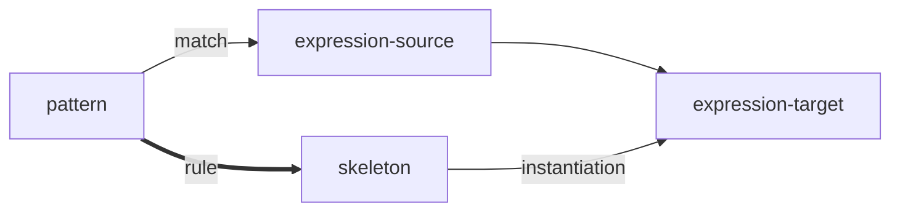

pattern match 的部分是书上 4.4.2 节，有点跳跃啊。

pattern

然后书上2.3.3开始介绍集合/二叉树/二叉搜索树/平衡二叉搜索树/哈希/huffman树，主打一个点到为止。

- pattern : something that matches
- skeleton : something you susbtitute into an expression in order to get a new expression

